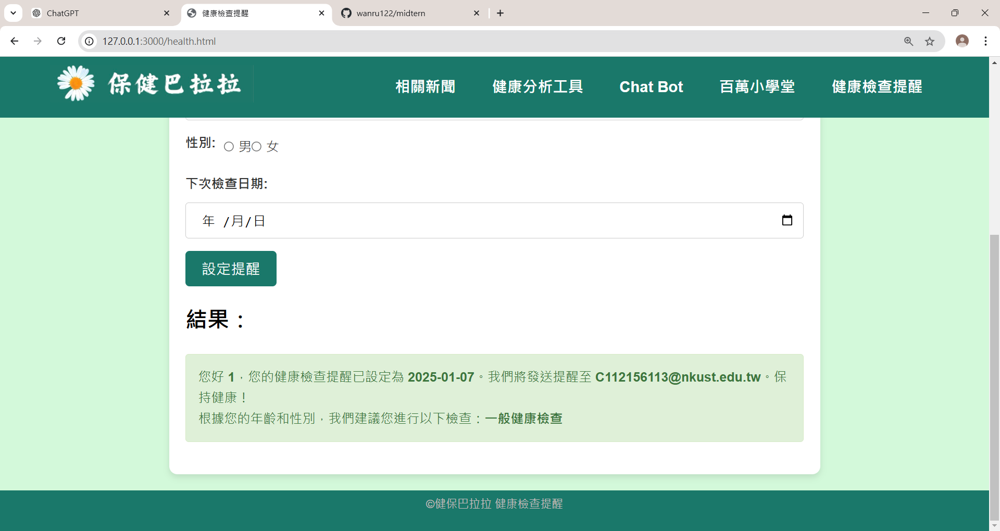

# 保健意識普及大作戰

## 專案簡介
本專案旨在透過網頁互動及視覺化方式，提升大眾對於健康保健的意識。網站提供了多項功能，包括：
- 健康分析工具
- Chat Bot
- 百萬小學堂
- 健康檢查提醒
- 人體健康知識介紹

## 分工表
| 組員姓名 | 負責項目 |
| -------- | -------- |
| 陳璿丞     | HTML 首頁排版設計 CHATBOT架設 整體CSS設計|
| 梁欣渝   | 健康分析工具設計 相關器官症狀設計 |
| 劉禹彤   | 圖片收集規劃  相關器官症狀設計 小樹動畫設計 企劃書|
| 李庭瑜   | 新聞相關設計 相關器官症狀設計|
| 蔡宛汝   | 相關器官症狀設計 健康檢查提醒 企劃書 |
| 蘇秉笙   | 相關器官症狀設計 百萬小學堂內容收集、設計|

## 專案結構
```
保健意識普及大作戰/
├── index.html             # 首頁
├── news.html              # 相關新聞頁面
├── cb.html                # Chat Bot
├── test.html              # 百萬小學堂
├── health.html            # 健康檢查提醒
├── style.css              # 樣式檔案
├── talk.js                # Chat Bot 邏輯
├── 健康分析工具/            
    └── bmi/submit.html    # BMI 計算工具
```


## 系統展示
### 主頁
- 使用html、css
- 上方人體圖為人體器官病症介紹


- 下方圓圈為大範圍疾病症狀(無分器官或是含有多個器官)
- 利用js偵測使用者觀看的時間，右下小樹會隨著時間變動變化

- 頁面展示


### 相關新聞
- 使用python爬取news api新聞


### Chat bot
- 嵌入一個簡單的聊天機器人，可以讓使用者方便的提問問題


### 百萬小學堂
- 簡單的小遊戲，內容是關於健保知識，希望可以透過這種方式讓使用者了解更多


### 健康分析工具
- 第一頁-bmi，bmr計算
- 使用者提供身高體重等資訊，為其計算bmr，bmi是否在正常範圍內

並依照BMI，BMR提供一天的飲食 三餐菜單，以及運動的菜單


### 健康檢查提醒
- 使用者輸入個人資料，系統會發送提醒訊息，並建議使用者檢查的種類

